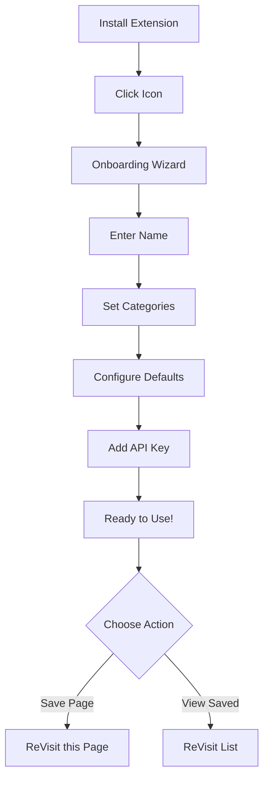
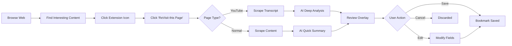
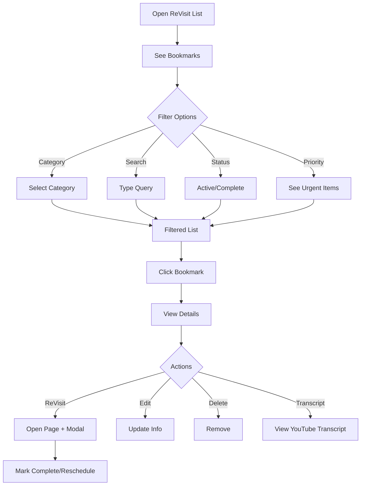

# ReVisit - AI-Powered Bookmark Manager

> Never lose track of important content. ReVisit uses AI to intelligently categorize, summarize, and remind you to revisit bookmarked pages at the perfect time.


---

## 📋 Table of Contents

1. [Overview](#overview)
2. [Current Features](#current-features)
3. [User Journey](#user-journey)
4. [Technical Architecture](#technical-architecture)
5. [Installation](#installation)
6. [User Guide](#user-guide)
7. [UX Enhancement Opportunities](#ux-enhancement-opportunities)
8. [Roadmap](#roadmap)
9. [Contributing](#contributing)

---

## Overview

**ReVisit** is a Chrome extension that transforms how you manage bookmarks. Instead of letting saved links fade into obscurity, ReVisit actively helps you engage with content at optimal intervals.

### The Problem We Solve

- 📚 **Bookmark Overload:** Average users have 100+ bookmarks they never revisit
- 🔍 **Poor Organization:** Manual categorization is tedious and inconsistent
- ⏰ **Timing Matters:** No system for when to revisit content
- 📝 **Context Loss:** No way to remember why you saved something

### Our Solution

- 🤖 **AI-Powered Categorization:** Automatically organizes bookmarks using Claude AI
- 📊 **Smart Summaries:** Get the essence without re-reading
- ⏱️ **Scheduled Revisits:** Set reminders to engage with content at the right time
- 🎯 **Priority View:** See what needs attention now
- 🎬 **YouTube Integration:** Full transcript extraction and analysis

---

## Current Features

### ✨ Core Features

#### 1. One-Click Bookmark Saving
**How it works:**
- Click the extension icon → "ReVisit this Page"
- AI automatically analyzes the page and generates:
  - Intelligent category suggestion
  - Concise summary (under 200 words for web pages)
  - Relevant tags (up to 10)
  - Suggested revisit date

**User Experience:**
```
User clicks → AI processes → Overlay appears → User reviews/edits → Saved!
Average time: 5-10 seconds
```

**Current Implementation:**
- Supports all web pages
- Special handling for YouTube videos
- Customizable before saving
- Automatic category creation

#### 2. YouTube Video Intelligence

**Enhanced Features for YouTube:**
- **Transcript Extraction:** Automatically scrapes video transcripts via DOM
- **Deep Summarization:** AI analyzes full transcript for comprehensive summaries
- **Structured Summaries:** Includes:
  - "Right Up Front" key takeaways with emojis
  - Main topics and themes
  - Referenced URLs
  - Fact-checking for sensational claims
- **Transcript Viewer:** Read formatted transcripts anytime
- **Multilingual Support:** Auto-translates non-English content to English

**Current Flow:**
1. User bookmarks YouTube video
2. Extension scrapes transcript from page DOM
3. AI analyzes transcript (full length, no truncation)
4. Generates detailed markdown summary
5. Formats transcript for readability
6. Saves both for future reference

**Example Output:**
```markdown
# The Future of AI in Healthcare

## Right Up Front
#### 🏥 * AI can reduce diagnostic errors by 40%
#### 💰 * Potential $150B in healthcare savings by 2026
#### 🤖 * Current accuracy: 94% vs human 87%

## The Real Real
### Say What??
- Claim: "AI will replace all doctors by 2025"
  * Implied: Complete automation of healthcare
  * Reality: AI augments but doesn't replace physicians
  * Consensus: Medical professionals view AI as a tool
```

#### 3. Smart Bookmark Management

**List View Features:**
- **Three-Column Layout:**
  - Categories (left)
  - Bookmark list (center)
  - Details panel (right)
- **Advanced Filtering:**
  - By category
  - By status (Active/ReVisited/Complete)
  - Full-text search across title, summary, notes, tags
- **Priority View:**
  - Highlights overdue items (red border)
  - Shows approaching deadlines (yellow border)
  - Smart scoring based on:
    - Days until due
    - Never visited before
    - Current status

**Status Management:**
- **Active:** Default state for new bookmarks
- **ReVisited:** Marked when you engage with content
- **Complete:** Finished, no longer needs attention

#### 4. Revisit Workflow

**Floating Modal System:**
1. Click "ReVisit" on any bookmark
2. Page opens in new tab
3. Floating modal appears on page with:
   - Revisit due date
   - "Complete" button → Marks as done
   - "Keep" button → Schedule new revisit date
   - Draggable position

**User Control:**
- Set custom revisit dates
- Reschedule anytime
- Track history of all revisits
- Never lose progress

#### 5. Personalization & Settings

**Onboarding Experience:**
- 4-step guided setup
- Collect user preferences:
  - **Step 1:** Your name
  - **Step 2:** Initial category interests
  - **Step 3:** Default revisit interval (1-30 days)
  - **Step 4:** Anthropic API key (stored locally)

**Customization Options:**
- Default revisit interval (1, 3, 7, 14, or 30 days)
- Priority threshold (days before due)
- Custom categories (auto-created when saving)
- Personal notes on every bookmark

#### 6. Data Export & Backup

**Export Functionality:**
- One-click JSON export
- Includes:
  - All bookmarks with metadata
  - Categories
  - Settings (excluding API key)
- Filename: `rv-backup-YYYY-MM-DD.json`
- Use for backup or migration

---

## User Journey

### First-Time User Flow



### Bookmark Saving Flow



### Revisit Flow



---

## Technical Architecture

### Technology Stack

**Frontend:**
- Vanilla JavaScript (ES6+)
- Chrome Extension APIs (Manifest V3)
- Custom CSS (no frameworks)

**Backend/Services:**
- Chrome Local Storage
- Anthropic Claude API (Haiku 4.5)
- DOM Scraping (YouTube transcripts)

**Architecture Pattern:**
- Service Worker (background.js)
- Content Scripts (content.js)
- Popup UI (popup.html/js)
- Full-page Modal (list-modal.html/js)
- Onboarding Flow (onboarding.html/js)

### Data Flow

```
User Action → Popup → Background Service Worker → Chrome APIs
                ↓                                       ↓
          Content Script ← ← ← ← ← ← ← ← ←  Anthropic API
                ↓
          DOM Overlay → User Interaction → Storage → List View
```

### Storage Schema

**Primary Data Structure:**
```javascript
{
  "rvData": {
    "bookmarks": [
      {
        "id": "rv-1234567890-abc123",
        "url": "https://example.com",
        "title": "Page Title",
        "category": "Research",
        "summary": "AI-generated markdown summary...",
        "tags": ["ai", "technology", "research"],
        "userNotes": "Personal notes...",
        "addedTimestamp": 1234567890000,
        "revisitBy": "2024-12-31T00:00:00.000Z",
        "status": "Active",
        "history": [
          {
            "timestamp": 1234567890000,
            "action": "ReVisited"
          }
        ]
      }
    ],
    "categories": ["Articles", "Research", "Work", "Personal"],
    "settings": {
      "userName": "John Doe",
      "defaultIntervalDays": 7,
      "apiKey": "sk-ant-...",
      "onboardingComplete": true,
      "priorityThresholdDays": 3
    }
  },
  "rvTranscripts": {
    "VIDEO_ID": {
      "raw": "Raw transcript text...",
      "formatted": "# Formatted Markdown...",
      "metadata": {
        "title": "Video Title",
        "videoId": "VIDEO_ID",
        "retrievedAt": 1234567890000,
        "source": "dom-scraping"
      }
    }
  }
}
```

---

## Installation

### For Users

#### Option 1: Chrome Web Store (Coming Soon)
1. Visit Chrome Web Store
2. Search for "ReVisit"
3. Click "Add to Chrome"
4. Follow onboarding wizard

#### Option 2: Manual Installation (Developer Mode)
1. Download the source code
2. Open Chrome → `chrome://extensions/`
3. Enable "Developer mode" (top right)
4. Click "Load unpacked"
5. Select the ReVisit folder
6. Click the extension icon to start onboarding

### Prerequisites

**Required:**
- Chrome Browser (version 88+)
- Anthropic API Key ([Get one here](https://console.anthropic.com/))

**Optional:**
- YouTube account (for transcript access on some videos)

---

## User Guide

### Getting Started

#### 1. Complete Onboarding
- Enter your name for personalization
- Choose initial categories (or use defaults)
- Set your preferred revisit interval
- Add your Anthropic API key

**💡 Tip:** Your API key is stored locally and never transmitted except to Anthropic's API.

#### 2. Save Your First Bookmark
1. Navigate to any webpage
2. Click the ReVisit extension icon
3. Click "ReVisit this Page"
4. Wait 2-5 seconds for AI analysis
5. Review the suggested category, summary, and tags
6. Add personal notes (optional)
7. Adjust the revisit date if needed
8. Click "Save Bookmark"

#### 3. Manage Your Bookmarks
1. Click extension icon → "ReVisit List"
2. Browse categories on the left
3. Click any bookmark to view details
4. Use search bar for quick finding
5. Toggle "Priority View" to see urgent items

### Best Practices

**📌 Categorization:**
- Let AI suggest categories first (usually accurate)
- Create new categories for recurring themes
- Keep category names concise (1-2 words)

**📝 Personal Notes:**
- Add context: "Why did I save this?"
- Note specific sections to revisit
- Include action items

**⏰ Revisit Timing:**
- **1 day:** Time-sensitive content
- **7 days:** Standard articles
- **14 days:** Long-form content
- **30 days:** Reference material

**🎯 Priority Management:**
- Review priority view daily
- Mark completed items promptly
- Reschedule instead of deleting

### Keyboard Shortcuts

Currently none, but see [UX Enhancements](#ux-enhancement-opportunities) for proposed additions.

---

## UX Enhancement Opportunities

### 🚀 High-Impact Improvements

#### 1. **Smart Notifications**
**Current State:** No proactive reminders
**Proposed Enhancement:**
- Browser notifications when bookmarks are due
- Daily digest of overdue items
- Weekly summary of revisited content

**User Benefit:** Never miss important content
**Technical Complexity:** Medium
**Estimated Dev Time:** 2-3 days

```javascript
// Proposed Implementation
chrome.alarms.create('dailyRevisitCheck', {
  periodInMinutes: 1440 // 24 hours
});

chrome.alarms.onAlarm.addListener((alarm) => {
  if (alarm.name === 'dailyRevisitCheck') {
    const overdue = getOverdueBookmarks();
    if (overdue.length > 0) {
      chrome.notifications.create({
        type: 'basic',
        title: `${overdue.length} Bookmarks Need Attention`,
        message: 'Click to view your ReVisit list',
        iconUrl: 'icons/icon128.png'
      });
    }
  }
});
```

#### 2. **Keyboard Shortcuts**
**Current State:** Mouse-only navigation
**Proposed Shortcuts:**
- `Alt+Shift+R` → Quick save current page
- `Alt+Shift+L` → Open ReVisit list
- `Ctrl+Enter` → Save bookmark (in overlay)
- `Esc` → Cancel/close overlay
- `↑/↓` → Navigate bookmark list
- `/` → Focus search box
- `1-9` → Jump to category
- `C` → Toggle complete status
- `E` → Edit selected bookmark

**User Benefit:** Power users can work faster
**Technical Complexity:** Low
**Estimated Dev Time:** 1 day

#### 3. **Reading Time Estimates**
**Current State:** No time estimates
**Proposed Enhancement:**
- Calculate reading time for articles
- Show duration for YouTube videos
- Display in bookmark list
- Filter by time available

**Visual Mockup:**
```
[Article Title]
📚 Research | ⏱️ 8 min read | 📅 Due in 2 days
```

**User Benefit:** Better time management
**Technical Complexity:** Low
**Estimated Dev Time:** 1 day

#### 4. **Bulk Actions**
**Current State:** One-at-a-time actions
**Proposed Enhancement:**
- Multi-select bookmarks (checkboxes)
- Bulk actions:
  - Move to category
  - Change status
  - Delete
  - Reschedule
  - Export selection

**User Benefit:** Manage large collections efficiently
**Technical Complexity:** Medium
**Estimated Dev Time:** 2-3 days

#### 5. **Smart Collections**
**Current State:** Basic category filtering
**Proposed Enhancement:**
- **Smart Filters:**
  - "Read later" (< 10 min)
  - "Deep dive" (> 30 min)
  - "Never visited"
  - "Revisited 3+ times"
  - "Added this week"
- **Saved Searches:**
  - Save complex filter combinations
  - One-click access
  - Sync across devices

**User Benefit:** Advanced organization
**Technical Complexity:** Medium
**Estimated Dev Time:** 3-4 days

### 💡 Medium-Impact Improvements

#### 6. **Visual Themes**
**Current State:** Single light theme
**Proposed Enhancement:**
- Dark mode
- High contrast mode
- Customizable accent colors
- Compact/comfortable/spacious density

**User Benefit:** Accessibility and personalization
**Technical Complexity:** Low
**Estimated Dev Time:** 2 days

#### 7. **Bookmark Sharing**
**Current State:** No sharing capabilities
**Proposed Enhancement:**
- Generate shareable links
- Export as formatted email
- Share to social media
- Create public collections

**User Benefit:** Collaborate and share knowledge
**Technical Complexity:** High
**Estimated Dev Time:** 5-7 days

#### 8. **AI Improvements**
**Current State:** Single summary format
**Proposed Enhancement:**
- **Summary Styles:**
  - TL;DR (super brief)
  - Standard (current)
  - Detailed (comprehensive)
  - ELI5 (explain like I'm 5)
- **Custom Prompts:**
  - User-defined AI instructions
  - Domain-specific analysis (e.g., "Focus on code examples")
- **Re-summarize:**
  - Regenerate with different prompt
  - Compare summaries

**User Benefit:** Tailored AI analysis
**Technical Complexity:** Medium
**Estimated Dev Time:** 3-4 days

#### 9. **Related Content Suggestions**
**Current State:** Bookmarks are isolated
**Proposed Enhancement:**
- AI-powered "Related Bookmarks"
- Show similar content
- Group by topic clusters
- Suggest new content based on interests

**User Benefit:** Discover connections
**Technical Complexity:** High
**Estimated Dev Time:** 5-7 days

#### 10. **Statistics Dashboard**
**Current State:** No analytics
**Proposed Enhancement:**
- Total bookmarks saved
- Most common categories
- Completion rate
- Average revisit frequency
- Time saved (reading summaries vs full content)
- Category distribution chart
- Activity timeline

**User Benefit:** Insights and motivation
**Technical Complexity:** Medium
**Estimated Dev Time:** 3-4 days

### 🎨 Polish & Quality of Life

#### 11. **Drag-and-Drop Organization**
- Drag bookmarks between categories
- Reorder bookmark list
- Drag to delete

#### 12. **Quick Add from Context Menu**
- Right-click any link → "Add to ReVisit"
- Save without navigating to page

#### 13. **Browser Sync**
- Sync bookmarks across Chrome devices
- Cloud backup option
- Multi-device access

#### 14. **Offline Mode**
- Cache summaries for offline reading
- Queue actions when offline
- Sync when back online

#### 15. **Import/Export Enhancements**
- Import from browser bookmarks
- Import from Pocket, Instapaper
- Export to Notion, Obsidian
- Export to PDF report

#### 16. **Advanced Search**
- Filter by date range
- Search in transcripts
- Regex support
- Saved search queries

#### 17. **Customizable Default Fields**
- Pre-fill category based on domain
- Auto-tag based on keywords
- Smart date suggestions

#### 18. **Undo/Redo**
- Undo delete
- Undo bulk actions
- History of changes

#### 19. **Accessibility Improvements**
- Screen reader support
- Full keyboard navigation
- High contrast mode
- Font size adjustment
- Focus indicators

#### 20. **Mobile Companion App**
- iOS/Android app
- Sync with Chrome extension
- Mobile-optimized UI
- Push notifications

---

## Roadmap

### Version 1.1 (Q1 2024)
**Focus: Stability & Performance**
- [ ] Fix critical bugs (see ARCHITECTURE.md)
- [ ] Remove duplicate code
- [ ] Optimize AI API calls (50% cost reduction)
- [ ] Reduce storage operations
- [ ] Add error handling

### Version 1.2 (Q2 2024)
**Focus: UX Enhancements**
- [ ] Keyboard shortcuts
- [ ] Smart notifications
- [ ] Reading time estimates
- [ ] Bulk actions
- [ ] Dark mode

### Version 2.0 (Q3 2024)
**Focus: Advanced Features**
- [ ] AI improvement options
- [ ] Statistics dashboard
- [ ] Smart collections
- [ ] Browser sync
- [ ] Import from other services

### Version 2.1 (Q4 2024)
**Focus: Collaboration**
- [ ] Bookmark sharing
- [ ] Public collections
- [ ] Team workspaces
- [ ] Comment threads

### Version 3.0 (2025)
**Focus: Platform Expansion**
- [ ] Firefox support
- [ ] Safari support
- [ ] Mobile apps (iOS/Android)
- [ ] Web app version
- [ ] API for third-party integrations

---

## Contributing

### How to Contribute

We welcome contributions! Here's how you can help:

#### 🐛 Report Bugs
- Check [existing issues](https://github.com/yourusername/ReVisit/issues)
- Include steps to reproduce
- Add screenshots if applicable
- Mention your Chrome version

#### 💡 Suggest Features
- Check [UX Enhancements](#ux-enhancement-opportunities) first
- Open a new issue with "Feature Request" label
- Describe the problem it solves
- Provide mockups if possible

#### 🔧 Submit Pull Requests
1. Fork the repository
2. Create a feature branch (`git checkout -b feature/amazing-feature`)
3. Make your changes
4. Test thoroughly
5. Commit (`git commit -m 'Add amazing feature'`)
6. Push (`git push origin feature/amazing-feature`)
7. Open a Pull Request

#### 📚 Improve Documentation
- Fix typos
- Add examples
- Clarify confusing sections
- Translate to other languages

### Development Setup

```bash
# Clone the repository
git clone https://github.com/yourusername/ReVisit.git
cd ReVisit

# Load extension in Chrome
# 1. Open chrome://extensions/
# 2. Enable "Developer mode"
# 3. Click "Load unpacked"
# 4. Select the ReVisit folder

# Make changes
# Test in Chrome

# Submit PR
```

### Code Style

- Use ES6+ features
- Comment complex logic
- Follow existing naming conventions
- Add debug logs (prefix with `DEBUG:`)
- Handle errors gracefully

### Testing Checklist

Before submitting PR:
- [ ] Test on regular web pages
- [ ] Test on YouTube videos
- [ ] Test with long transcripts
- [ ] Test with no internet
- [ ] Test with invalid API key
- [ ] Test export/import
- [ ] Check for console errors
- [ ] Verify storage limits

---

## FAQ

### General Questions

**Q: Is my data private?**
A: Yes! All data is stored locally in Chrome. Your API key is never transmitted except directly to Anthropic's API for processing.

**Q: How much does it cost?**
A: The extension is free. You only pay for Anthropic API usage (typically $0.001-0.01 per bookmark).

**Q: Can I use it offline?**
A: Partially. You can view existing bookmarks offline, but adding new ones requires internet for AI processing.

**Q: What happens if I uninstall?**
A: All data is deleted. Export your data first!

### Technical Questions

**Q: Why do I need an API key?**
A: We use Anthropic's Claude AI for content analysis. Running AI locally would drain battery and require large downloads.

**Q: Can I use my own AI model?**
A: Not currently, but this is a planned feature.

**Q: What's the storage limit?**
A: Chrome's local storage limit is 10MB (~2,000-5,000 bookmarks).

**Q: Does it work on Firefox/Safari?**
A: Not yet. Chrome/Edge only for now.

### Troubleshooting

**Q: AI analysis fails with "API error"**
A: Check your API key in settings. Verify it's valid at console.anthropic.com.

**Q: YouTube transcripts not working**
A: Some videos don't have transcripts, or the creator disabled them.

**Q: Extension not loading**
A: Try disabling/re-enabling in `chrome://extensions/`. Check for Chrome updates.

**Q: Bookmarks not saving**
A: Check available storage. Clear old bookmarks or export data.

---

## Support

### Get Help

- **Documentation:** Read this README and ARCHITECTURE.md
- **Issues:** [GitHub Issues](https://github.com/yourusername/ReVisit/issues)
- **Discussions:** [GitHub Discussions](https://github.com/yourusername/ReVisit/discussions)
- **Email:** support@revisit-extension.com

### Sponsor the Project

If ReVisit saves you time, consider sponsoring development:
- [GitHub Sponsors](https://github.com/sponsors/yourusername)
- [Buy Me a Coffee](https://buymeacoffee.com/yourusername)

---

## License

MIT License - see [LICENSE](LICENSE) file for details.

---

## Acknowledgments

- **Anthropic** for Claude API
- **Chrome Extensions Team** for excellent documentation
- **Community Contributors** for feedback and suggestions
- **You!** for using ReVisit

---

## Stats


---

**Made with ❤️ by developers who forget to revisit their bookmarks**

*Last updated: 2024*
