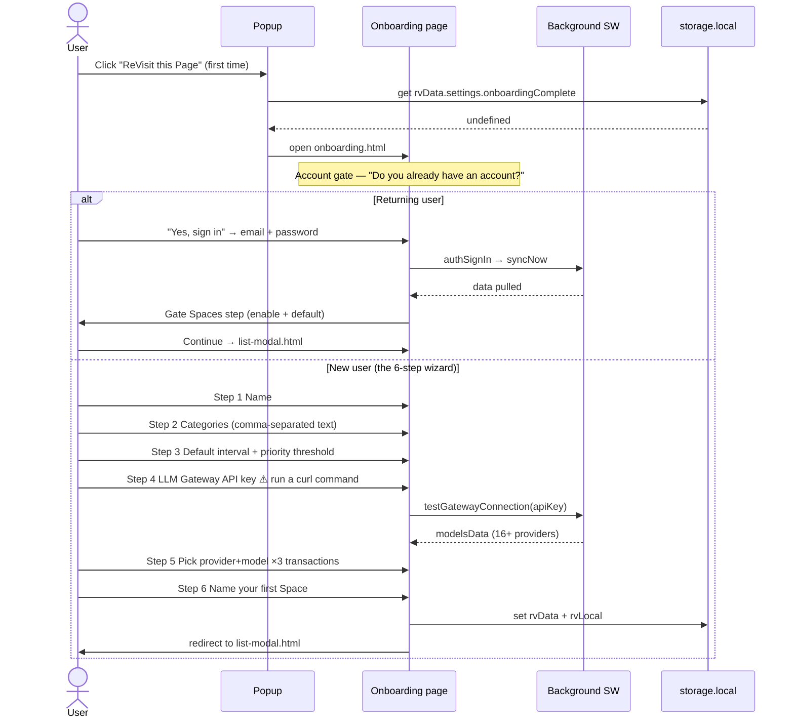
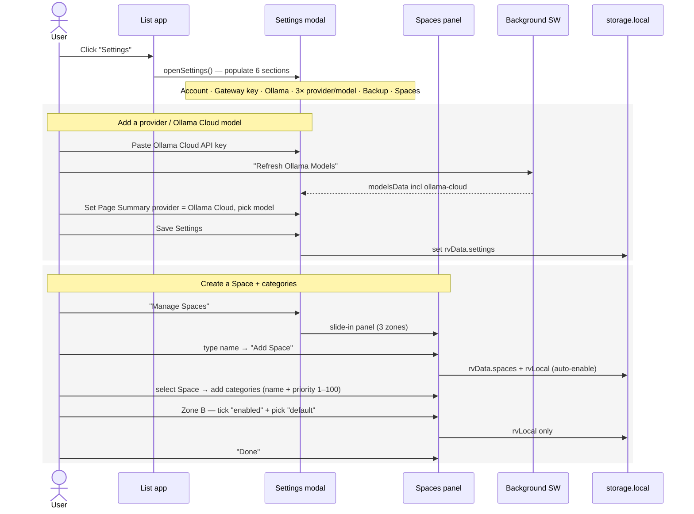
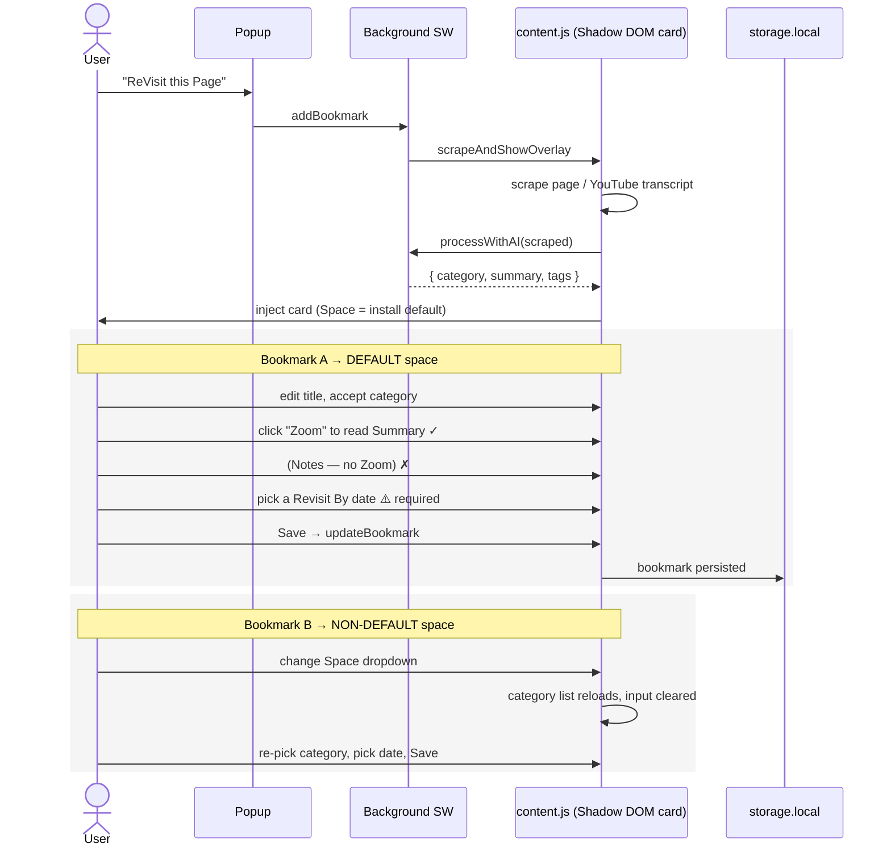

# ReVisit — End‑User Walkthrough & Annotated Flow Analysis

> A first‑person walk through the product as a real user experiences it, with a
> Mermaid sequence diagram per flow. Every diagram is annotated with **🟥 UX
> issues** (what breaks the user's intent / mental model) and **🟦 UI issues**
> (what looks or feels unrefined). Code references use `file:line`.
>
> Scope note: this document is **diagnosis only**. Recommendations live in
> `02-recommendations.md`; visual options live in `/mockups`.

---

## 0. The product in one paragraph

ReVisit is a Chrome extension (Manifest V3) that turns "I'll look at this later"
into a scheduled, AI‑enriched bookmark. From any page you hit **ReVisit this
Page**; a content‑script overlay scrapes the page (or a YouTube transcript),
sends it to an LLM gateway for a summary + category + tags, and saves a bookmark
with a **Revisit By** date. A full‑tab **ReVisit List** lets you triage by
Space → Category → Status, edit details, and re‑open links. Data lives in
`chrome.storage.local` under `rvData` (synced) and `rvLocal` (per‑install), with
optional Supabase cloud sync.

**Surfaces:** `popup.html` (toolbar menu) · `onboarding.html` (setup wizard) ·
`content.js` (injected capture card) · `list-modal.html` (the main app) — the
last one also hosts the **detail/edit overlay**, the **settings modal**, and the
**Spaces manager** panel.

**The throughline of every problem below:** the *logic* is largely sound and even
generous (there's a working revisit‑scheduling engine in the background), but the
*UI is three different design eras stacked on top of each other* — a flat‑blue
"sample" app, a Bootstrap‑colored settings panel, and an inline‑styled onboarding
page — none of which match the warm, skeuomorphic brand logo. The result reads as
"AI slop": generic Inter type, three competing blues, a rainbow of button colors,
and emoji standing in for an icon system.

---

## 1. Onboarding

**Files:** `popup.js:2`, `onboarding.html`, `onboarding.js`

A first click on **ReVisit this Page** with no completed onboarding redirects to
the wizard (`popup.js:3‑5`). The wizard actually contains **two** front doors (an
account gate and a 6‑step new‑user wizard) plus a **third** per‑install "choose
your Spaces" gate.



**🟥 UX issues**
- **U1 — Two mental models collide at the door.** "Account gate" then "wizard" is
  two onboardings bolted together (`onboarding.html:110‑147` vs `149‑326`). A new
  user briefly wonders whether "No, I'm new" loses the ability to sync later.
- **U2 — The `curl` step is a wall.** Step 4 instructs the user to open a terminal
  and run a `curl -X POST …/admin/apps` command to mint an API key
  (`onboarding.html:213‑215`). For a bookmarking tool aimed at general users this
  is disqualifying — most people cannot complete onboarding at all.
- **U3 — Three "transactions" is jargon overload.** Step 5 asks the user to choose
  a provider **and** model for *YouTube Summary*, *Transcript Formatting*, and
  *Web Page Summary* separately (`onboarding.html:254‑309`). Six dropdowns before
  the user has saved a single bookmark. The word "transaction" is developer‑facing.
- **U4 — Required fields that should be optional.** `completeOnboarding()` hard‑blocks
  on name + gateway key + all six provider/model fields (`onboarding.js:320‑328`).
  There is no "skip AI for now / use defaults" path.
- **U5 — Categories as a comma string.** Step 2 is a single text input defaulted to
  `Articles, Research, Work, Personal` (`onboarding.html:171`). No examples of *why*
  categories matter, no per‑category affordance, and these defaults are generic.
- **U6 — Spaces explained twice, late.** The concept of a "Space" first appears at
  step 6 ("name your first Space," `onboarding.html:317‑325`) and again in the
  returning‑user gate — but the user has already entered categories in step 2 that
  silently become that Space's categories (`onboarding.js:301‑306`). Cause→effect is
  hidden.

**🟦 UI issues**
- **V1 — Onboarding is a different design system.** The page has its own inline
  `<style>` block (`onboarding.html:7‑104`) with a *different* blue (`#4a90e2`) than
  the app's `#3B82F6`, Bootstrap‑ish buttons, and **no dark mode**. It does not look
  like the same product as the list view.
- **V2 — Terminal block styling screams "for developers."** The green‑on‑black
  `<pre>` curl block (`onboarding.html:213`) is the visual centerpiece of step 4.
- **V3 — Progress dots, no labels.** Six identical dots (`onboarding.html:150‑157`)
  give no sense of how long setup is or what each step covers.
- **V4 — Dense, unstyled forms.** Stacked full‑width inputs with 20px bottom margins
  and no grouping rhythm; the `.alert` boxes are the only color.

---

## 2. Settings — providers/models, Spaces, categories

**Files:** `list-modal.html:108‑355`, `list-modal.js:672‑1518`

Settings is a modal launched from the header. Inside it are six stacked sections
(Account, LLM Gateway, Ollama, AI Provider Settings ×3, Backup/Restore, Spaces),
and Spaces opens a **separate slide‑in panel** with three more zones.



**🟥 UX issues**
- **U7 — "Test Connection" lies.** The gateway **Test Connection** button in the
  list settings is a **mock** — it `setTimeout(1000)` then always reports success
  (`list-modal.js:196‑211` / `204‑209`). A user with a bad key is told it works.
  (Onboarding's test is real, via `testGatewayConnection`; the in‑app one is not.)
- **U8 — Provider/model configured in three places, forever.** The same 2‑dropdown
  block is repeated for YouTube / Transcript / Page (`list-modal.html:205‑279`).
  Most users want "use model X for everything"; there's no global default.
- **U9 — Adding an Ollama Cloud model is a multi‑tool ritual.** Paste key → *Test* →
  *Refresh Ollama Models* → re‑open the right transaction dropdown → pick the model →
  *Save Settings*. Four buttons, easy to forget "Refresh" (without it the model
  never appears, `list-modal.js:1053‑1092`).
- **U10 — Deleting a Space asks you to *type a word*.** `onDeleteSpace()` uses
  `window.prompt(...)` and requires typing the literal string `reassign` or
  `delete` (`list-modal.js:1265‑1285`). This is a CLI confirmation pattern in a GUI.
- **U11 — Two category‑ordering mechanisms.** Categories can be reordered by **drag**
  *and* by typing a **priority number 1–100** (`list-modal.js:1357‑1486`). Two ways
  to do one thing, and the number field invites collisions/gaps.
- **U12 — Spaces concept is heavy.** A first‑time user meets a *setup gate*
  (`list-modal.js:1654`), a *synced definitions* zone, a *per‑install enable/default*
  zone, and a *category editor* zone — three different scopes in one panel
  (`list-modal.html:308‑355`). The enabled/default vs synced distinction is subtle
  and unexplained beyond help text.

**🟦 UI issues**
- **V5 — The settings modal ignores the theme.** Its CSS is hardcoded light: white
  panel, `#333` text, `#f9f9f9` header (`styles.css:789‑870`). In dark mode the rest
  of the app is `#121212` but the settings modal flashes pure white. (The
  `.settings-overlay` block is even **duplicated** in `styles.css:325` and `:775`.)
- **V6 — Rainbow buttons.** Settings uses Bootstrap‑era semantic colors: green
  primary `#28a745`, teal info `#17a2b8`, gray secondary `#6c757d`, red close
  `#dc3545` (`styles.css:893‑918`, `814`). Four button hues in one panel — the
  clearest "AI slop" tell.
- **V7 — Emoji as the icon system.** Every section header is an emoji: ⚙️ 🔑 🦙 🎯 💾
  🗂️ ☁️ 📺 📝 🌐 (`list-modal.html:118‑296`). Emoji render differently per OS and
  read as placeholder, not design.
- **V8 — Panel‑on‑modal stacking.** The Spaces panel slides in *over* the settings
  modal (z‑index 10001 over 10000, `styles.css:1095`/`1101`), so two scrim layers
  and two close buttons ("Close", "Done") are visible at once.

---

## 3. Capturing bookmarks — "ReVisit this Page"

**Files:** `content.js:892‑1125`, `background.js` (processWithAI)

From any page, **ReVisit this Page** scrapes content, runs AI, and injects a
Shadow‑DOM card pre‑filled with Title / Space / Category / Summary / Tags / Notes /
Revisit By. We save **bookmark A to the default Space** and **bookmark B to a
non‑default Space**.



**🟥 UX issues**
- **U13 — You cannot save without a Revisit date.** Save does
  `new Date(rv-revisit.value).toISOString()` (`content.js:1120`). With the date
  empty, `new Date('')` is *Invalid Date* and `.toISOString()` **throws** — the save
  silently fails. There is no "just bookmark it / no reminder / someday" option.
  This is the user's exact complaint, and it's a hard wall, not a nudge.
- **U14 — Zoom is asymmetric.** Summary has a **Zoom** button to read it full‑card
  (`content.js:963‑966`, `1012‑1027`); **Your Notes** is a plain `<textarea>`
  (`content.js:976‑978`) with no expand. You can comfortably read the AI's words but
  not your own.
- **U15 — Switching Space wipes your category.** Changing the Space dropdown clears
  the category input because a name from the old Space may not exist in the new one
  (`content.js:1050‑1056`). Sensible defensively, but feels like losing work.
- **U16 — No "where did it go?" confirmation.** After Save the card just closes with
  a toast (`content.js:1171‑1175`); the user gets no link to the item or its Space.
- **U17 — Long AI calls, thin feedback.** Between click and card there's only a
  single "Analyzing content…" toast (`content.js:724`); on a slow model the page
  looks inert.

**🟦 UI issues**
- **V9 — A *fourth* design dialect.** The card is its own token set inside
  `OVERLAY_STYLES` (`content.js:9‑420`) — to its credit it *does* support
  `prefers-color-scheme: dark` (`content.js:72‑80`), which the app's own settings
  modal does not. But that means capture follows the OS theme while the List follows
  a manual toggle: the same bookmark can be edited in two different color schemes.
- **V10 — Fixed‑height summary box.** `.summary-rendered` is locked to 110px
  (`content.js:266`); hence the Zoom crutch instead of a naturally sized field.
- **V11 — Date input as the only scheduler.** A bare `<input type="date">`
  (`content.js:982`) — no "tomorrow / next week / in a month" quick chips, which is
  the actual mental model for "remind me later."

---

## 4. The ReVisit List — triage, priority, the ReVisit button, editing

**Files:** `list-modal.html:28‑106`, `list-modal.js:237‑652`

The main app: a left sidebar (search + status tabs + categories) and a middle
bookmark list, with a detail overlay for editing.

```mermaid
sequenceDiagram
    actor U as User
    participant L as List app
    participant DO as Detail overlay
    participant ST as storage.local

    U->>L: open list-modal.html
    L->>L: renderCategories() + renderLinks()
    Note over L: filter by Space + Category + Status + search, then sort

    U->>L: click "Priority View"
    L->>L: sort by getPriorityScore() — 3 buckets only
    Note over L: no per-row priority cue; order within a bucket arbitrary

    U->>L: click a bookmark row
    L->>DO: openDetailOverlay()
    U->>DO: edit title / category / status / date / summary / notes
    U->>DO: Save → saveData()
    DO->>ST: rvData persisted

    U->>L: click "ReVisit ↗" on a row
    L->>L: window.open(url)  ⚠️ does NOT mark revisited or move the date
```

**🟥 UX issues**
- **U18 — The ReVisit button doesn't revisit.** The row's **ReVisit ↗** button only
  `window.open(bookmark.url)` (`list-modal.js:319‑322`). It does **not** change
  status and does **not** advance `revisitBy`. Yet `background.js:1187‑1197` has a
  fully working handler that, on a `ReVisited` action, pushes `revisitBy` forward by
  `defaultIntervalDays`, sets status `Active`, and logs history — **nothing in the
  list calls it.** There's even a draggable "Complete / Keep" reminder modal
  (`background.js:~1600‑1653`) that is **never triggered** (the only alarm drives
  sync, `background.js:609`). *The date‑driven engine the product is named after is
  built but unplugged.*
- **U19 — Priority is three coarse buckets, invisible.** `getPriorityScore()` returns
  100 (overdue) / 50 (≤3 days) / 10 (else) (`list-modal.js:1635‑1643`). So "Priority
  View" is just "overdue first," with arbitrary order inside each tier and **no
  badge, color, or label** on any row to show which tier an item is in. Its
  usefulness today is near‑zero: it answers "what's overdue?" but you can't *see*
  priority without toggling the sort.
- **U20 — No real sort.** The only ordering control is the Priority⇄Date toggle
  (`list-modal.js:162‑168`, `285‑289`). No sort by title, date added, recently
  updated, or category. For a list that grows unbounded this is a serious gap.
- **U21 — Status "ReVisited" is a dead end.** It exists as a filter tab
  (`list-modal.html:39`) and an edit dropdown value (`:85`) but, per U18, no action
  ever sets it. Users will never see anything in the ReVisited tab unless they set it
  by hand in the editor.
- **U22 — No summary preview in the list.** Rows show only title, hostname, and date
  (`list-modal.js:299‑308`). The AI summary — arguably the most valuable field — is
  invisible until you open the overlay. "Show me the gist without opening the link"
  is impossible.
- **U23 — Clicking a row vs the button is fiddly.** The whole row opens the editor;
  one small button in the corner opens the URL (`list-modal.js:311‑322`). The two
  primary verbs ("read it now" vs "edit it") compete in one hit area.
- **U24 — Search says one thing, does another.** Placeholder is
  "Search categories…" (`list-modal.html:31`) but the handler searches bookmark
  title/summary/notes/tags (`list-modal.js:147‑150`, `277‑280`).
- **U25 — Tags are captured but never filterable.** Bookmarks carry tags
  (`content.js:1118`) and the editor manages them (`list-modal.js:368‑399`), but the
  list has no tag filter — only Category + Status + free‑text search.
- **U26 — Inadequate default Spaces/Categories.** A new user lands with one Space
  ("My Bookmarks") and four generic categories. Nothing models the actual job
  ("read later," "watch," "reference," "buy").

**🟦 UI issues**
- **V12 — Buttons styled inline in JS.** Each row's ReVisit button is built with an
  inline `style="…"` string (`list-modal.js:306`); the row actions can't be themed
  or restyled from CSS and don't match anything else.
- **V13 — The search icon.** A 24‑px SVG sits in the search bar via absolute
  positioning (`list-modal.html:32‑34`, `styles.css:186‑195`) — historically it
  rendered oversized/below the field (see `redesign_issues.md`).
- **V14 — Rows are low‑information and flat.** Title / host / date with a single
  bottom‑right button (`list-modal.js:299‑308`). No favicon, no category chip, no
  status/priority indicator, no relative time ("due in 2 days"). Lots of vertical
  space, little signal.
- **V15 — The edit overlay is a tall scroll.** Title, tag row, a 3‑column metadata
  card, then two large markdown areas stacked (`list-modal.html:62‑105`). The
  primary metadata (when do I see this again?) is visually equal to everything else,
  and there's **no link to open the page** from inside the editor.
- **V16 — Markdown editor swaps under you.** The summary/notes fields render HTML on
  blur and reveal raw text on focus (`list-modal.js:413‑425`); content visibly
  changes shape as you click in and out, which feels unstable.
- **V17 — Native dialogs.** Unsaved‑changes and delete use `window.confirm`
  (`list-modal.js:331`, `360`, `641`); Space delete uses `window.prompt` (U10).
  Off‑brand OS chrome for the app's most important moments.

---

## 5. Cross‑cutting findings

### 5.1 Four design dialects, one product
| Surface | Token source | Theme support | Primary blue | Buttons |
|---|---|---|---|---|
| Onboarding | inline `<style>` | none | `#4a90e2` | flat blue/gray |
| List + overlays | `styles.css` `:root` | manual toggle | `#3B82F6` | flat blue |
| Settings modal | `styles.css` "restored" | **hardcoded light** | `#4a90e2` headers | Bootstrap rainbow |
| Capture card | `content.js` OVERLAY_STYLES | `prefers-color-scheme` | `#3B82F6` | flat blue |

Four answers to "what color is this product, and is it dark right now?" No single
source of truth for tokens.

### 5.2 The brand is warmer than the app
The logo (`icons/ReVisit Logo.png`) is a cream paper luggage‑tag with a hand‑drawn
blue script wordmark and a red check — playful, tactile, "a note you'll come back
to." The UI is cold flat‑blue Inter. **Either** the logo modernizes to match the
UI **or** the UI warms up to match the logo — today they're strangers. This is the
single biggest lever for an identity that doesn't feel generic. (Explored as a
named direction in `02-recommendations.md` and `/mockups`.)

### 5.3 Built‑but‑unplugged logic (design can light these up with little/no logic risk)
- `updateBookmarkStatus('ReVisited')` advances the date + logs history — *wire the
  row action to it* (`background.js:1187`).
- `updateBookmarkStatus('Complete')` exists too (`background.js:1178`).
- The "Complete / Keep" reminder modal is fully built (`background.js:~1640`).
- These mean the **ReVisit action model can be fixed mostly by connecting existing
  endpoints to new buttons** — not by writing new sync logic. (Good news for the
  "avoid logic changes around cloud sync" constraint.)

### 5.4 Severity heat‑map
| # | Issue | Sev | Type | Logic risk to fix |
|---|---|---|---|---|
| U13 | Can't save without a date (throws) | 🔴 High | UX | minor |
| U18 | ReVisit button doesn't revisit | 🔴 High | UX | minor (wire existing) |
| U7 | Fake "Test Connection" | 🔴 High | UX | minor |
| V5 | Settings modal ignores dark theme | 🔴 High | UI | none (CSS) |
| U2 | curl step blocks onboarding | 🔴 High | UX | medium |
| V6/V7 | Rainbow buttons + emoji icons | 🟠 Med | UI | none (CSS) |
| U19/U20 | Shallow priority, no sort | 🟠 Med | UX | minor |
| U22 | No summary preview in list | 🟠 Med | UX | none (render existing field) |
| U8/U9 | Triple provider config / Ollama ritual | 🟠 Med | UX | medium |
| U10/U11 | prompt-to-delete, dual cat ordering | 🟠 Med | UX | minor |
| U3/U4/U5 | Onboarding jargon/required fields | 🟠 Med | UX | medium |
| U14/U24/U25 | Notes zoom, search label, tag filter | 🟡 Low | UX | none/minor |
| V1‑V4, V8‑V17 | Visual inconsistency, flat rows, native dialogs | 🟡 Low–Med | UI | none (mostly CSS/markup) |

The encouraging pattern: **most High/Med items are UI‑only or "wire an existing
endpoint" — exactly the low‑logic‑risk changes the brief asks for.**
