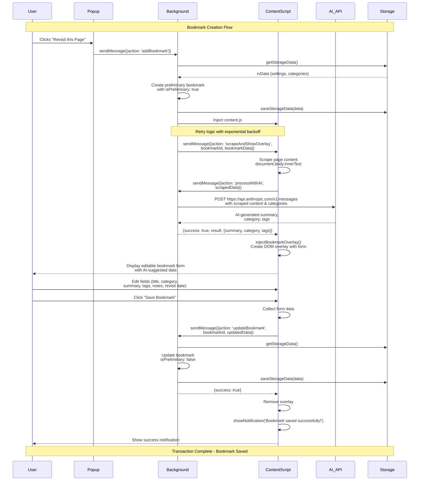

Based on my analysis of the codebase, here's a Mermaid swimlane diagram documenting the user/system transactions from "User Clicks 'Revisit this Page'" to "Save Bookmark":

## Key Transaction Details

### **Phase 1: Initiation (Popup → Background)**
- **Trigger**: User clicks "Revisit this Page" button in [`popup.js`](popup.js:2)
- **Action**: Popup sends `addBookmark` message to background script
- **Pre-check**: Verifies onboarding is complete before proceeding

### **Phase 2: Preliminary Setup (Background Processing)**
- **Storage**: Loads settings and categories from [`chrome.storage.local`](background.js:115)
- **Bookmark Creation**: Generates preliminary bookmark with [`isPreliminary: true`](background.js:136)
- **Content Script Injection**: Injects [`content.js`](background.js:149) into current tab with retry logic

### **Phase 3: Content Scraping & AI Processing**
- **Page Scraping**: Content script extracts [`document.body.innerText`](content.js:68)
- **AI Processing**: Background sends scraped data to Anthropic API for summarization, categorization, and tag generation
- **API Call**: [`POST` to `https://api.anthropic.com/v1/messages`](background.js:254) with categories context

### **Phase 4: User Interaction (Overlay Display)**
- **Overlay Injection**: Content script injects editable overlay form into page DOM
- **AI Pre-population**: Form fields pre-filled with AI-generated suggestions
- **User Editing**: User can modify all fields before saving

### **Phase 5: Final Save (Content Script → Background → Storage)**
- **Form Submission**: User clicks "Save Bookmark" button
- **Data Collection**: Content script gathers final form values
- **Bookmark Update**: Background updates bookmark, removing [`isPreliminary`](background.js:209) flag
- **Persistence**: Final bookmark saved to [`chrome.storage.local`](background.js:211)
- **Confirmation**: Success notification displayed to user

The diagram shows the complete asynchronous flow across all system components, including error handling, retry mechanisms, and the critical role of the AI API in generating intelligent bookmark metadata.