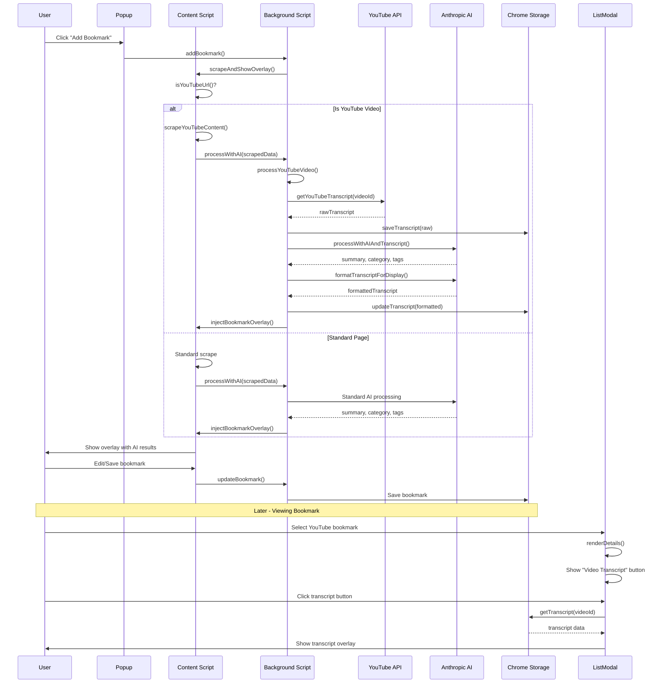

# YouTube Transcript Integration Architecture

## Overview

This document outlines the architecture for adding YouTube transcript support to the ReVisit browser extension. The feature will automatically detect YouTube videos, extract transcripts, and provide a rich viewing experience for users.

## Current Architecture Analysis

### Existing Flow
1. **Content Script** (`content.js`): Scrapes page content (title, body text)
2. **Background Script** (`background.js`): Processes content with AI, manages bookmarks
3. **List Modal** (`list-modal.js/html`): Displays and manages bookmarks
4. **Storage**: Uses `chrome.storage.local` with `rvData` key containing bookmarks, categories, settings

### Key Integration Points
- `content.js`: `handleScrapeAndShowOverlay()` - Main scraping entry point
- `background.js`: `processWithAI()` - AI processing function
- `background.js`: `addBookmark()` - Bookmark creation flow
- `list-modal.js`: `renderDetails()` - Bookmark details display

## Enhanced Architecture for YouTube Support

### 1. YouTube Detection & Content Scraping

**Location**: `content.js`

```javascript
// Enhanced scraping function
function handleScrapeAndShowOverlay(bookmarkId, preliminaryBookmark) {
  const url = window.location.href;
  
  if (isYouTubeUrl(url)) {
    // YouTube-specific handling
    const scrapedData = scrapeYouTubeContent();
    // ... rest of flow
  } else {
    // Standard scraping
    const bodyText = document.body.innerText || '';
    // ... existing logic
  }
}

function isYouTubeUrl(url) {
  return url.includes('youtube.com/watch') || url.includes('youtu.be/');
}

function scrapeYouTubeContent() {
  const videoId = extractVideoId(window.location.href);
  const title = document.title.replace(' - YouTube', '');
  
  // Get description from meta tag or page
  const descriptionMeta = document.querySelector('meta[name="description"]');
  const description = descriptionMeta ? descriptionMeta.content : '';
  
  return {
    url: window.location.href,
    title: title,
    content: description.substring(0, 2000), // Description only, no comments
    isYouTube: true,
    videoId: videoId
  };
}

function extractVideoId(url) {
  const urlObj = new URL(url);
  return urlObj.searchParams.get('v') || urlObj.pathname.split('/').pop();
}
```

### 2. Transcript Storage Architecture

**New Data Structure**: Separate storage key for transcripts

```javascript
// Storage structure
{
  rvData: {
    bookmarks: [...],
    categories: [...],
    settings: {...}
  },
  rvTranscripts: {
    "videoId1": {
      raw: "raw transcript text for AI",
      formatted: "# Formatted Transcript\n\n**[0:00]** Introduction...\n\n**[0:15]** Main topic...",
      metadata: {
        title: "Video Title",
        videoId: "videoId1",
        bookmarkId: "rv-12345",
        retrievedAt: 1234567890
      }
    }
  }
}
```

**Rationale**: 
- Separate storage key prevents transcript data from bloating main bookmark data
- Indexed by videoId for efficient lookup
- Stores both raw (for AI) and formatted (for display) versions
- Metadata links back to bookmark for easy reference

### 3. Transcript Retrieval & Processing Workflow

**Location**: `background.js`

```javascript
// Enhanced processWithAI function
async function processWithAI(scrapedData, settings, categories) {
  if (scrapedData.isYouTube) {
    return await processYouTubeVideo(scrapedData, settings, categories);
  } else {
    return await processStandardPage(scrapedData, settings, categories);
  }
}

async function processYouTubeVideo(scrapedData, settings, categories) {
  // Step 1: Get transcript
  const transcriptData = await getYouTubeTranscript(scrapedData.videoId);
  
  // Step 2: Save raw transcript
  await saveTranscript(scrapedData.videoId, {
    raw: transcriptData.raw,
    metadata: {
      title: scrapedData.title,
      videoId: scrapedData.videoId,
      retrievedAt: Date.now()
    }
  });
  
  // Step 3: Process with AI using title, description, AND transcript
  const aiResult = await processWithAIAndTranscript(
    scrapedData.title,
    scrapedData.content, // description
    transcriptData.raw,
    settings,
    categories
  );
  
  // Step 4: Format transcript for human reading
  const formattedTranscript = await formatTranscriptForDisplay(
    transcriptData.raw,
    settings.apiKey
  );
  
  // Step 5: Update transcript with formatted version
  await updateTranscript(scrapedData.videoId, {
    formatted: formattedTranscript
  });
  
  return aiResult;
}

async function getYouTubeTranscript(videoId, lang = 'en') {
  try {
    // Step 1: Get video page to find caption tracks
    const videoPage = await fetch(`https://www.youtube.com/watch?v=${videoId}`);
    const html = await videoPage.text();
    
    // Step 2: Extract caption track URL from page
    const captionRegex = /"captionTracks":(\[.*?\])/;
    const match = html.match(captionRegex);
    
    if (!match) {
      throw new Error('No captions found');
    }
    
    const captionTracks = JSON.parse(match[1]);
    const track = captionTracks.find(t => t.languageCode === lang);
    
    if (!track) {
      throw new Error(`No ${lang} captions found`);
    }
    
    // Step 3: Fetch the actual transcript
    const transcriptResponse = await fetch(track.baseUrl);
    const transcriptXML = await transcriptResponse.text();
    
    // Step 4: Parse XML
    const parser = new DOMParser();
    const xmlDoc = parser.parseFromString(transcriptXML, 'text/xml');
    const textNodes = xmlDoc.getElementsByTagName('text');
    
    const transcript = Array.from(textNodes).map(node => ({
      text: node.textContent,
      start: parseFloat(node.getAttribute('start')),
      duration: parseFloat(node.getAttribute('dur'))
    }));
    
    return transcript;
    
  } catch (error) {
    console.error('Error:', error);
    return null;
  }
}

// Usage example:
// getYouTubeTranscript('dQw4w9WgXcQ').then(transcript => {
//   console.log(transcript);
// });

// Extract video ID from current page
// const videoId = new URLSearchParams(window.location.search).get('v');
// if (videoId) {
//   getYouTubeTranscript(videoId).then(transcript => {
//     console.log('Transcript:', transcript);
//     // Do something with the transcript
//   });
// }

async function formatTranscriptForDisplay(rawTranscript, apiKey) {
  const prompt = `Reformat this YouTube transcript to make it "pretty" and readable for humans in markdown format. 
  Add timestamps in a clean format and improve readability:
  
  ${rawTranscript}
  
  Return ONLY the formatted markdown transcript.`;
  
  const response = await fetch('https://api.anthropic.com/v1/messages', {
    method: 'POST',
    headers: {
      'Content-Type': 'application/json',
      'x-api-key': apiKey,
      'anthropic-version': '2023-06-01',
      'anthropic-dangerous-direct-browser-access': 'true'
    },
    body: JSON.stringify({
      model: 'claude-haiku-4-5-20251001',
      max_tokens: 4000,
      messages: [{ role: 'user', content: prompt }]
    })
  });
  
  const data = await response.json();
  return data.content[0].text;
}
```

### 4. UI/UX Design for Transcript Button

**Location**: `list-modal.js` - Enhanced `renderDetails()` function

```javascript
function renderDetails(bookmark) {
  const isYouTube = isYouTubeUrl(bookmark.url);
  const videoId = isYouTube ? extractVideoId(bookmark.url) : null;
  
  const html = `
    <div>
      <div class="details-header">
        <h2>${bookmark.title}</h2>
        <div>
          ${isYouTube ? `<button id="transcript-btn" class="transcript-btn">Video Transcript</button>` : ''}
          <button id="edit-btn">Edit</button>
          <button id="delete-btn" style="background: #dc3545; color: white; border: none; padding: 6px 12px; border-radius: 4px; cursor: pointer;">Delete</button>
        </div>
      </div>
      <!-- ... rest of existing details ... -->
    </div>
    
    <!-- Transcript Overlay -->
    <div id="transcript-overlay" class="transcript-overlay" style="display: none;">
      <div class="transcript-modal">
        <div class="transcript-header">
          <h3>Video Transcript</h3>
          <button id="close-transcript" class="close-btn">&times;</button>
        </div>
        <div class="transcript-content" id="transcript-content">
          <div class="loading">Loading transcript...</div>
        </div>
      </div>
    </div>
  `;
  
  container.innerHTML = html;
  
  // Add transcript button handler
  if (isYouTube) {
    document.getElementById('transcript-btn').addEventListener('click', () => {
      showTranscriptOverlay(videoId);
    });
    
    document.getElementById('close-transcript').addEventListener('click', () => {
      document.getElementById('transcript-overlay').style.display = 'none';
    });
  }
}

async function showTranscriptOverlay(videoId) {
  const overlay = document.getElementById('transcript-overlay');
  const content = document.getElementById('transcript-content');
  
  overlay.style.display = 'flex';
  
  // Check if transcript exists in storage
  const transcriptData = await getTranscript(videoId);
  
  if (transcriptData && transcriptData.formatted) {
    content.innerHTML = renderMarkdown(transcriptData.formatted);
  } else if (transcriptData && transcriptData.raw) {
    // Fallback to raw if formatted not available
    content.innerHTML = `<pre>${transcriptData.raw}</pre>`;
  } else {
    content.innerHTML = '<div class="error">Transcript not available. Try refreshing the bookmark.</div>';
  }
}
```

**CSS Styles** (add to `styles.css`):

```css
/* Transcript Button */
.transcript-btn {
  background: #ff0000; /* YouTube red */
  color: white;
  border: none;
  padding: 6px 12px;
  border-radius: 4px;
  cursor: pointer;
  font-size: 14px;
  margin-right: 8px;
}

.transcript-btn:hover {
  background: #cc0000;
}

/* Transcript Overlay */
.transcript-overlay {
  position: fixed;
  top: 0;
  left: 0;
  right: 0;
  bottom: 0;
  background: rgba(0, 0, 0, 0.8);
  z-index: 10000;
  display: flex;
  align-items: center;
  justify-content: center;
}

.transcript-modal {
  background: white;
  border-radius: 8px;
  width: 90%;
  max-width: 800px;
  max-height: 90vh;
  display: flex;
  flex-direction: column;
}

.transcript-header {
  display: flex;
  justify-content: space-between;
  align-items: center;
  padding: 20px;
  border-bottom: 1px solid #e0e0e0;
}

.transcript-content {
  flex: 1;
  overflow-y: auto;
  padding: 20px;
  line-height: 1.6;
}

.transcript-content h1, .transcript-content h2, .transcript-content h3 {
  margin-top: 20px;
}

.transcript-content pre {
  background: #f5f5f5;
  padding: 15px;
  border-radius: 4px;
  overflow-x: auto;
}
```

### 5. Storage Helper Functions

**Location**: `background.js`

```javascript
// Transcript storage helpers
async function saveTranscript(videoId, transcriptData) {
  const result = await chrome.storage.local.get('rvTranscripts');
  const transcripts = result.rvTranscripts || {};
  
  transcripts[videoId] = {
    ...transcripts[videoId],
    ...transcriptData
  };
  
  await chrome.storage.local.set({ rvTranscripts: transcripts });
}

async function getTranscript(videoId) {
  const result = await chrome.storage.local.get('rvTranscripts');
  return result.rvTranscripts ? result.rvTranscripts[videoId] : null;
}

async function updateTranscript(videoId, updates) {
  const result = await chrome.storage.local.get('rvTranscripts');
  const transcripts = result.rvTranscripts || {};
  
  if (transcripts[videoId]) {
    transcripts[videoId] = {
      ...transcripts[videoId],
      ...updates
    };
    await chrome.storage.local.set({ rvTranscripts: transcripts });
  }
}
```

## Workflow Diagram



## Implementation Phases

### Phase 1: Core YouTube Detection & Storage
- Add YouTube URL detection
- Create transcript storage structure
- Implement basic transcript retrieval
- Test with sample YouTube videos

### Phase 2: AI Integration
- Enhance AI processing to handle transcripts
- Implement transcript formatting with AI
- Test AI summarization quality with transcripts

### Phase 3: UI/UX Implementation
- Add transcript button to list modal
- Create transcript overlay
- Style and test user experience

### Phase 4: Polish & Optimization
- Add error handling for transcript failures
- Implement caching strategies
- Add loading states and user feedback
- Test edge cases (private videos, no transcripts, etc.)

## Technical Considerations

### YouTube Transcript API
- Uses native JavaScript implementation that extracts captions directly from YouTube's page data
- No external dependencies required - pure browser JavaScript
- Works by parsing the video page HTML to find caption track URLs
- Fetches and parses XML transcript data from YouTube's servers
- Handles multiple languages and gracefully falls back when captions aren't available
- Error handling for private videos, deleted content, and videos without captions

### AI Processing
- Raw transcript goes to AI for summarization (better context)
- Separate AI call to format transcript for human reading
- Consider token limits for long videos
- Implement truncation strategy for very long transcripts

### Storage Management
- Transcripts can be large - implement size limits
- Consider auto-cleaning old transcripts
- Link transcripts to bookmarks for easy cleanup when bookmark deleted

### Privacy & Security
- Transcripts may contain sensitive content
- Store only in local Chrome storage (no cloud sync)
- Clear transcripts when extension data is cleared
- Respect YouTube's terms of service

## Success Metrics

1. **Functionality**: Successfully extracts transcripts from 90%+ of public YouTube videos
2. **AI Quality**: Summaries that incorporate transcript content are more comprehensive
3. **User Experience**: Transcript button appears only for YouTube videos, overlay is intuitive
4. **Performance**: No noticeable slowdown in bookmark creation process
5. **Storage**: Efficient storage usage, no excessive memory consumption

## Future Enhancements

- Search within transcripts
- Export transcripts to various formats (PDF, TXT, MD)
- Timestamp navigation in transcript overlay
- Multi-language transcript support
- Transcript editing capabilities
- Share transcript excerpts